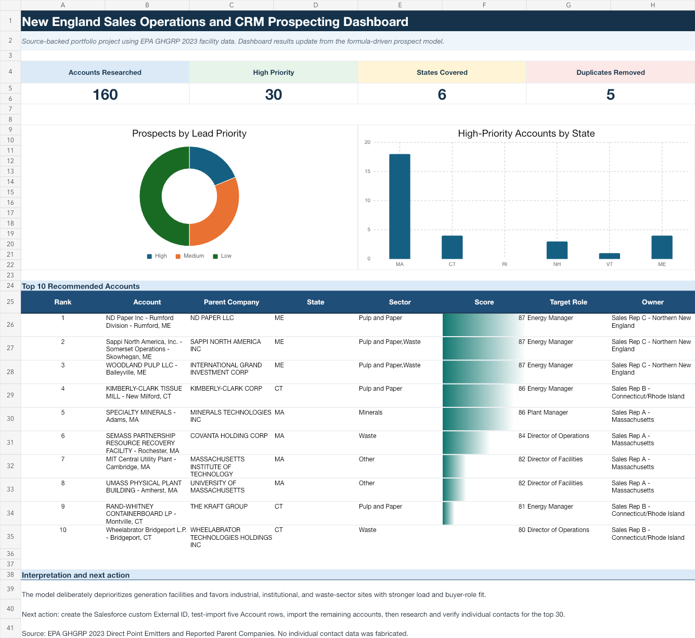
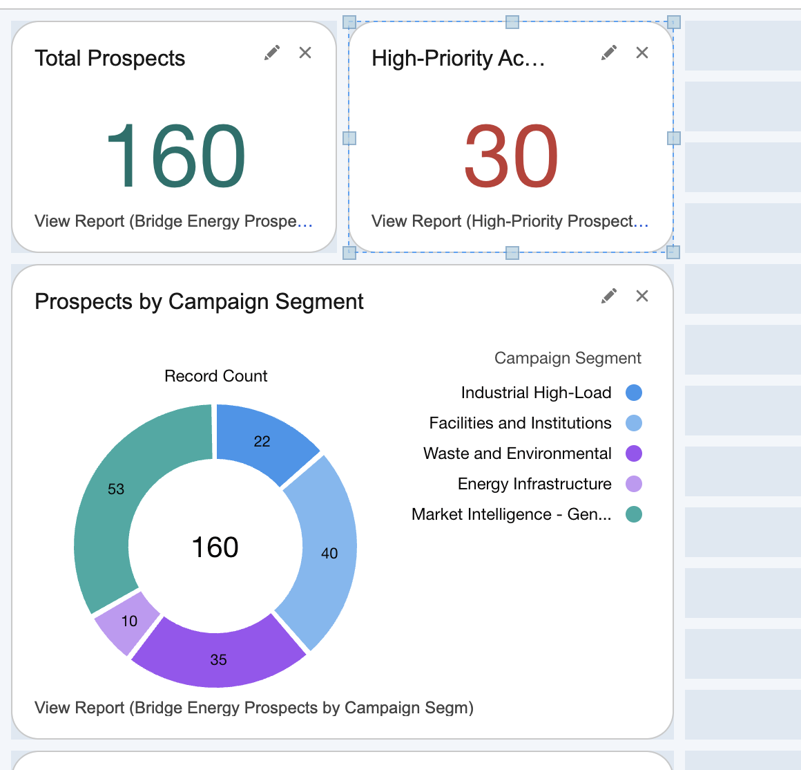
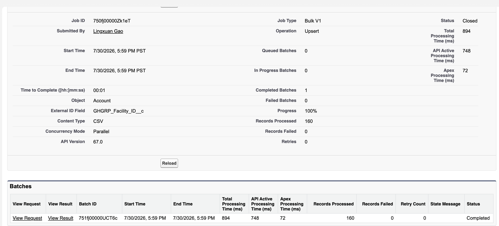
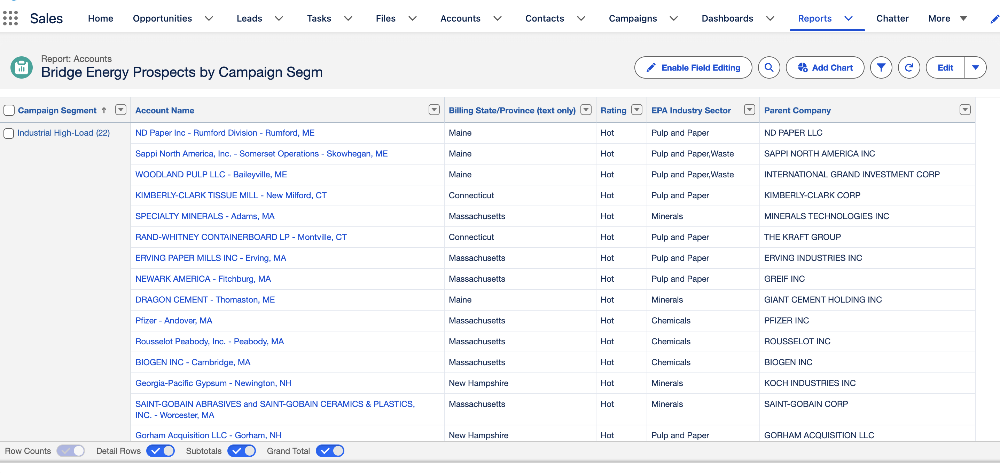
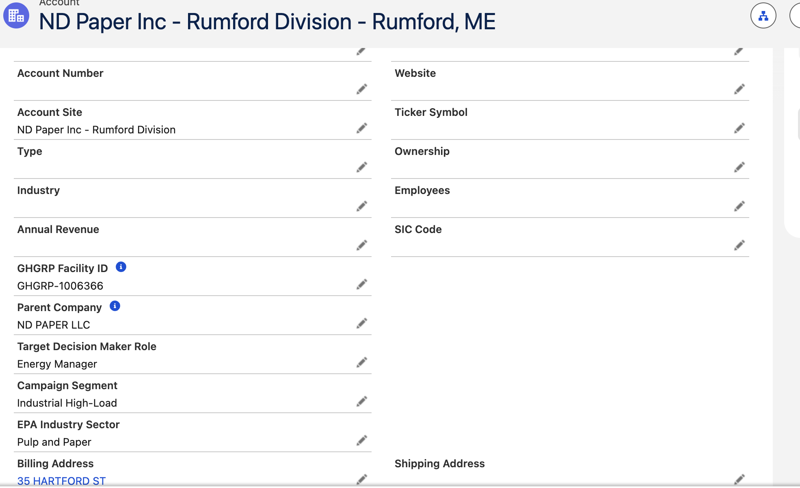

# New England Sales Operations & CRM Prospecting

An independent portfolio project that turns public EPA facility data into a
sales-operations workflow: prospect research, data cleaning, Excel lead
scoring, Salesforce Account upsert, segmented reporting, and dashboarding.

> This is a self-directed project created for skills demonstration. It is not
> affiliated with or commissioned by Bridge Energy Services, Salesforce, or
> the companies represented in the public source data.

## Results at a glance

| Outcome | Result |
|---|---:|
| Unique facility-level prospects | 160 |
| New England states covered | 6 |
| Reported parent companies | 116 |
| Synthetic duplicate records identified and removed | 5 |
| High-priority prospects | 30 |
| Salesforce Account records upserted | 160 |
| Salesforce import failures | 0 |
| Segmented Salesforce list views | 5 |
| Salesforce summary reports | 3 |

## What I built

### 1. Prospect research and data preparation

- Filtered the EPA Greenhouse Gas Reporting Program dataset to commercial and
  industrial facilities in Massachusetts, Connecticut, Rhode Island, New
  Hampshire, Vermont, and Maine.
- Joined facility records to the EPA parent-company file and standardized
  company, industry, location, source, and target-role fields.
- Used the stable EPA facility identifier as an external key and documented
  removal of five synthetic duplicate rows created specifically for the
  deduplication demonstration.

### 2. Excel lead scoring and campaign segmentation

- Built a formula-driven, 100-point scoring model using geography, industry
  fit, operational scale, data completeness, and account viability.
- Ranked the 160 prospects into 30 High, 50 Medium, and 80 Low priority
  accounts.
- Created five outreach segments and an executive dashboard with editable
  scoring assumptions.



### 3. Salesforce CRM implementation

- Configured five custom Account fields:
  `GHGRP Facility ID`, `Parent Company`, `Target Decision Maker Role`,
  `Campaign Segment`, and `EPA Industry Sector`.
- Upserted all 160 Account records using `GHGRP Facility ID` as a unique
  External ID; the completed job processed 160 records with zero failures.
- Created five segmented prospect list views, three summary reports, and a
  Salesforce dashboard showing 160 total prospects and 30 high-priority
  accounts.



<details>
<summary>Additional Salesforce evidence</summary>

#### Completed External ID upsert



#### Campaign-segment report



#### Custom Account fields



</details>

## Lead-scoring model

| Component | Maximum points | Business purpose |
|---|---:|---|
| Geography | 20 | Favor accounts aligned with a New England sales territory |
| Industry fit | 30 | Prioritize sectors with clearer energy-services relevance |
| Operational scale | 30 | Use reported direct emissions as a facility-scale proxy |
| Data quality | 10 | Reward complete parent, NAICS, location, role, and source fields |
| Account viability | 10 | Favor potential end customers over generation-only market context |

Reported direct emissions are used only as a transparent operational-scale
proxy. They are not utility consumption, revenue, employee count, or projected
account value.

## Salesforce segmentation

| Campaign segment | Accounts |
|---|---:|
| Industrial High-Load | 22 |
| Facilities and Institutions | 40 |
| Waste and Environmental | 35 |
| Energy Infrastructure | 10 |
| Market Intelligence - Generation | 53 |
| **Total** | **160** |

## Repository guide

| Path | Contents |
|---|---|
| [`workbook/`](workbook/) | Excel scoring model, campaign list, audit trail, and dashboard |
| [`data/`](data/) | Clean 160-row dataset, field definitions, and deduplication log |
| [`salesforce/`](salesforce/) | Full and five-row sample Account-import CSVs plus build notes |
| [`scripts/`](scripts/) | Reproducible Python data-preparation workflow |
| [`assets/screenshots/`](assets/screenshots/) | Excel and Salesforce implementation evidence |

## Reproduce the data preparation

The script expects the EPA 2023 facility summary workbook and the corresponding
2023 parent-company workbook.

```bash
python -m venv .venv
source .venv/bin/activate
pip install -r requirements.txt

python scripts/prepare_data.py \
  --facility-xlsx /path/to/2023_facility_summary.xlsx \
  --parent-xlsx /path/to/ghgp_data_parent_company.xlsb \
  --project-dir /path/to/output-directory
```

The script asserts that the output contains 160 unique facility IDs and exactly
30 high-priority prospects.

## Data sources

- [EPA GHGRP datasets](https://www.epa.gov/ghgreporting/data-sets)
- [EPA 2023 facility summary ZIP](https://www.epa.gov/system/files/other-files/2024-10/2023_data_summary_spreadsheets.zip)
- [EPA reported parent-company file](https://www.epa.gov/system/files/other-files/2024-10/ghgp_data_parent_company.xlsb)

The facility source was reported as of August 16, 2024. Project research and
processing were completed July 30, 2026.

## Scope and limitations

- Target decision-maker fields identify relevant **roles**, not verified
  individual people.
- No personal email addresses, phone numbers, or inferred contact details are
  included.
- ZoomInfo was not used; this project demonstrates the equivalent prospect
  research and CRM workflow with public EPA data.
- Repository data reflects a learning project, not a live sales pipeline or a
  recommendation to contact any listed organization.
